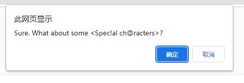
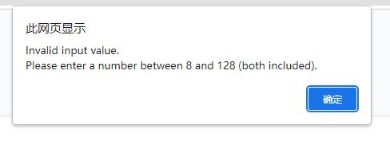
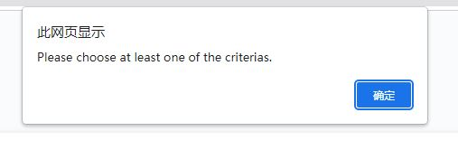

# Module 3 Challenge

## Objective:
* Create a random password generator. The user can choose different criterias that apply to the password.
* The user can choose the length of the password (8-128 charactors).
* The user can confirm whether or not to include lowercase, uppercase, numeric, and/or special characters.
* The user's input should be validated and at least one character type should be selected.
* After the user answered all prompts, a password is generated that matches the selected criteria and password is either displayed in an alert or written to the page.

## The Outcome:
* A prompt will appear when the user clicks "generate password" button.

 

 
 
 

* After input the password value, the webpage will ask if the user want to add certain criterias.

Add lowercase letters:

 

 
 
 

Add uppercase letters:

 

 
 
 

Add numbers:

 

 
 
 

Add special characters

 

 
 
 

* The password was generated. It contains all selected characters.

 

 
 
 

* If the user entered an invalid value for password length, an alarm will appear.

 

 
 
 

* If the user choose "No" (cancel) for all criterias, an alarm will appear and the function will terminate.

 

 
 
 

## The objectives are accomplished! Yay! 

## Installation

The project was uploaded to a [github](https://github.com/) repository. You can get access from [here](https://github.com/RicenUdonLover/Module3_Challenge_Lian_Liu.git).
 
You can also see the deployed webpage [over here](https://ricenudonlover.github.io/Moulde2_Challenge_Lian_Liu/).
